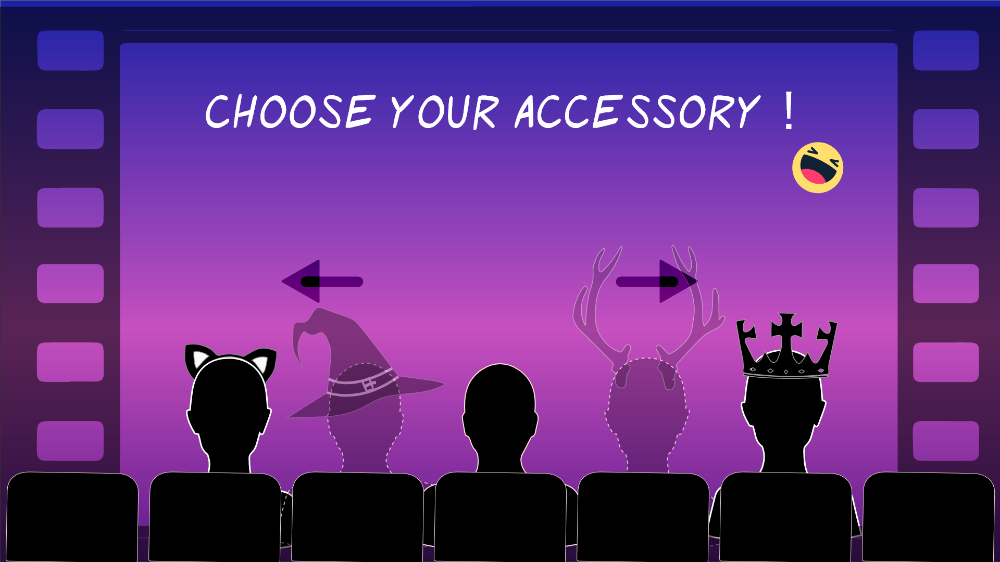

import Aside from '/src/components/Aside.astro';
import ImageModal from '/src/components/ImageModal.astro';
import Video from '/src/components/Video.astro';

<Aside 
  emoji="🚀 "
  title="Role: Unity Developer"
  involvement="2.5 months"
  tools="Unity3D, Re:Wired"
  status="Released"
  developer="Student Team"
/>

  <iframe width="100%" height="315" src="https://www.youtube.com/embed/C0DstMu-0qQ?si=0Q1xA8Zv3OW_ZQCF" title="Our First Kiss Trailer" frameborder="0" allow="accelerometer; autoplay; clipboard-write; encrypted-media; gyroscope; picture-in-picture; web-share" allowfullscreen></iframe>

I assisted with prototyping the initial theater movement mechanic that allowed players to see their avatars move closer for their kiss.

Their Arduino plugin (that made it alt controller) was new to me and as a result was fun to tinker with.

  
  
I used C# and another controller input plugin called Re:wired to test out logic on gamepads. Working on this project gave me more confidence in my prototyping abilities and as a collaborator.

  I was complimented on my professionalism with consistent updates and effective follow-up questions to ensure I had the right requirements to prototype what the team needed.

  The whole experience was smooth and successful. They got to present their project at the 20th anniversary of the [GDC Experimental Gameplay Workshop↗](https://schedule.gdconf.com/session/experimental-gameplay-workshop-20th-anniversary/885916) as well!

  
  

